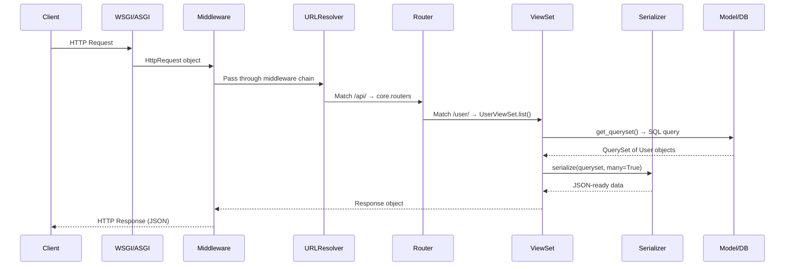
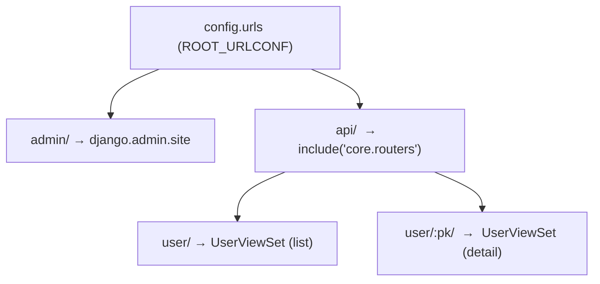
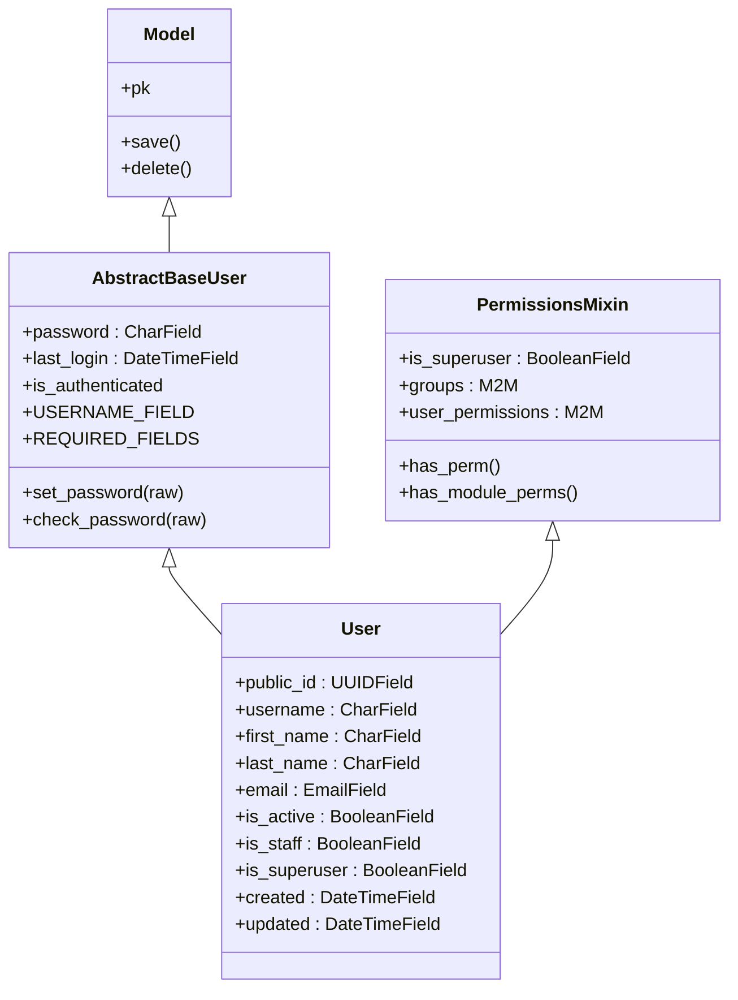
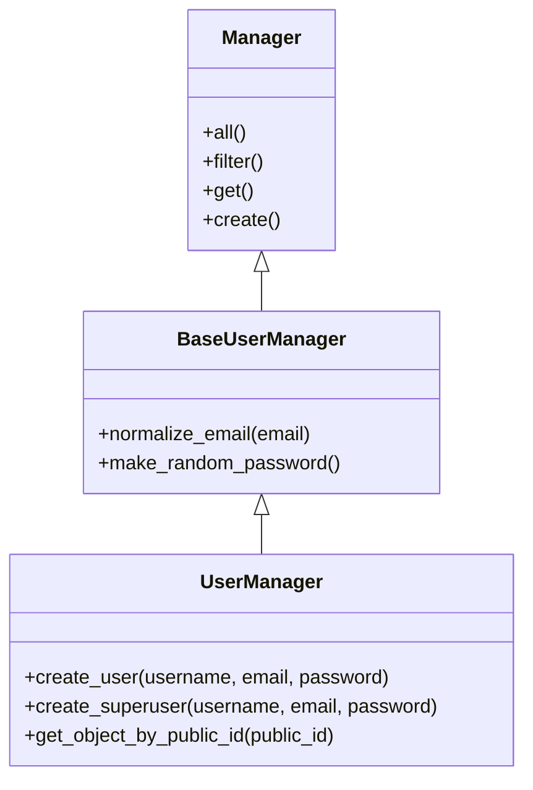
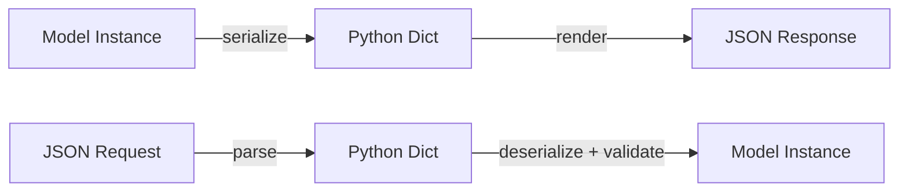
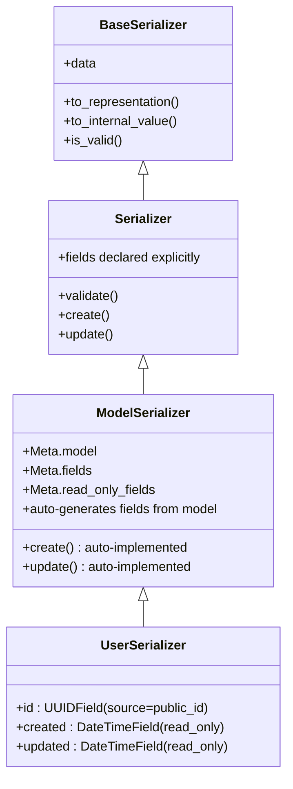
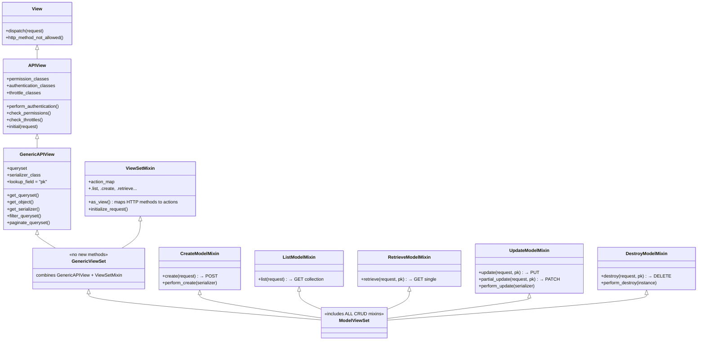
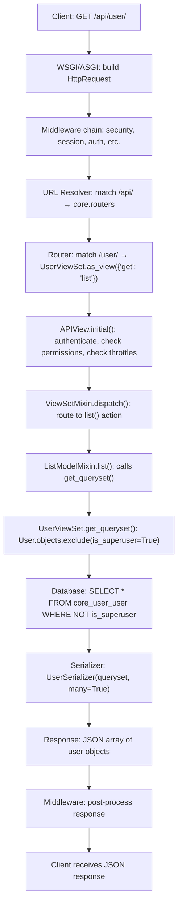

# Django + DRF Internals — Deep Reference Notes

> **Purpose**: A comprehensive reference you can revisit to master Django and Django REST Framework.
> Covers this project's actual code, inheritance chains, must-do vs optional rules, and memory aids.

---

## Table of Contents

1. [Architecture Overview & Request Lifecycle](#1-architecture-overview--request-lifecycle)
2. [Project Wiring: Settings, Apps, URLs](#2-project-wiring-settings-apps-urls)
3. [Custom User Model — Deep Dive](#3-custom-user-model--deep-dive)
4. [UserManager — Deep Dive](#4-usermanager--deep-dive)
5. [Serializers — Deep Dive](#5-serializers--deep-dive)
6. [ViewSets — Deep Dive (Inheritance Explained)](#6-viewsets--deep-dive-inheritance-explained)
7. [Router & URL Wiring](#7-router--url-wiring)
8. [Full Request Flow: GET /api/user/](#8-full-request-flow-get-apiuser)
9. [Database & Migrations](#9-database--migrations)
10. [Bug Fix Log](#10-bug-fix-log)
11. [Must-Do Rules vs Optional Choices](#11-must-do-rules-vs-optional-choices)
12. [How to Remember — Mnemonics & Mental Models](#12-how-to-remember--mnemonics--mental-models)
13. [Quick Reference Cheat Sheet](#13-quick-reference-cheat-sheet)

---

## 1) Architecture Overview & Request Lifecycle

### 1.1 Project structure

```
config/                  ← Project package (settings, urls, wsgi, asgi)
core/                    ← Parent app (shared routers.py lives here)
  user/                  ← Custom User model, serializer, viewset
    models.py            ← User + UserManager
    serializers.py       ← UserSerializer
    viewsets.py          ← UserViewSet
  auth/                  ← Auth app (scaffold, not yet implemented)
  routers.py             ← DRF SimpleRouter wiring
manage.py                ← CLI entry point
```

### 1.2 Request lifecycle diagram



### 1.3 MVC vs Django MVT

| Classic MVC | Django MVT                         | This Project                                         |
| ----------- | ---------------------------------- | ---------------------------------------------------- |
| Model       | Model                              | `User` in `core.user.models`                         |
| View (UI)   | Template                           | Not used (pure API)                                  |
| Controller  | View + URL dispatcher + Middleware | `UserViewSet` + `SimpleRouter` + middleware pipeline |

For a DRF API project, the "Template" layer is replaced by **Serializer** (data → JSON).

---

## 2) Project Wiring: Settings, Apps, URLs

### 2.1 How Django finds settings

Three entry points all set the same value:

| File             | Sets                                         |
| ---------------- | -------------------------------------------- |
| `manage.py`      | `DJANGO_SETTINGS_MODULE = "config.settings"` |
| `config/asgi.py` | same                                         |
| `config/wsgi.py` | same                                         |

### 2.2 INSTALLED_APPS and app labels

```python
INSTALLED_APPS = [
    "django.contrib.admin",
    "django.contrib.auth",        # ← Django's built-in auth
    "django.contrib.contenttypes",
    "django.contrib.sessions",
    "django.contrib.messages",
    "django.contrib.staticfiles",
    "rest_framework",              # ← DRF
    "core",                        # label = "core"
    "core.user",                   # label = "core_user" (set in AppConfig)
    "core.auth",                   # label = "core_auth" (set in AppConfig)
]
```

Why custom labels: when your app's Python module name (`user`, `auth`) would collide with a built-in, you must set a unique `label` in `AppConfig`.

### 2.3 URL tree



Generated URL patterns:

| Pattern           | Name          | HTTP Methods | ViewSet Action               |
| ----------------- | ------------- | ------------ | ---------------------------- |
| `/api/user/`      | `user-list`   | GET          | `list`                       |
| `/api/user/<pk>/` | `user-detail` | GET, PATCH   | `retrieve`, `partial_update` |

---

## 3) Custom User Model — Deep Dive

### 3.1 Inheritance chain



### 3.2 What each parent gives you

| From `AbstractBaseUser`               | From `PermissionsMixin`             | You define yourself              |
| ------------------------------------- | ----------------------------------- | -------------------------------- |
| `password` field (hashed)             | `is_superuser` field                | `public_id`, `username`, `email` |
| `last_login` field                    | `groups` M2M                        | `first_name`, `last_name`        |
| `set_password()` / `check_password()` | `user_permissions` M2M              | `is_active`, `is_staff`          |
| `is_authenticated` property           | `has_perm()` / `has_module_perms()` | `created`, `updated`             |
| Requires `USERNAME_FIELD`             | —                                   | `objects = UserManager()`        |

### 3.3 Key fields in this project

```python
class User(AbstractBaseUser, PermissionsMixin):
    public_id = models.UUIDField(db_index=True, unique=True, default=uuid.uuid4, editable=False)
    username  = models.CharField(db_index=True, max_length=255, unique=True)
    email     = models.EmailField(db_index=True, unique=True)
    is_active = models.BooleanField(default=True)
    is_staff  = models.BooleanField(default=False)        # needed for admin access
    created   = models.DateTimeField(auto_now_add=True)    # set once on creation
    updated   = models.DateTimeField(auto_now=True)        # set on every save

    USERNAME_FIELD  = "email"          # login identifier
    REQUIRED_FIELDS = ["username"]     # extra fields for createsuperuser
    objects = UserManager()
```

### 3.4 USERNAME_FIELD vs REQUIRED_FIELDS

```
                    ┌──────────────────────────────────┐
 createsuperuser    │  Prompts for:                    │
 command asks for:  │  1. USERNAME_FIELD  → email      │
                    │  2. REQUIRED_FIELDS → [username]  │
                    │  3. password (always)             │
                    └──────────────────────────────────┘
```

- `USERNAME_FIELD` = the unique identifier used for login. Must point to a unique field.
- `REQUIRED_FIELDS` = extra fields prompted during `createsuperuser`. Must NOT include `USERNAME_FIELD`.

### 3.5 AUTH_USER_MODEL setting

```python
AUTH_USER_MODEL = "core_user.User"   # format: "app_label.ModelName"
```

This tells the entire Django framework (auth, admin, migrations, ForeignKeys) to use your custom model instead of `django.contrib.auth.models.User`.

> **MUST-DO**: Set this **before your first migration**. Changing it after migrations exist is extremely painful.

---

## 4) UserManager — Deep Dive

### 4.1 What is a Manager?

A Manager is the interface between your model class and the database. When you write `User.objects.filter(...)`, `objects` **is** the manager.



### 4.2 create_user flow

```python
def create_user(self, username, email, password=None, **kwargs):
    # 1. Validate — fail fast
    if username is None: raise TypeError(...)
    if email is None:    raise TypeError(...)
    if password is None: raise TypeError(...)

    # 2. Build model instance with normalized email
    user = self.model(username=username, email=self.normalize_email(email), **kwargs)

    # 3. HASH the password (NEVER store raw)
    user.set_password(password)

    # 4. Save to database
    user.save(using=self._db)
    return user
```

> **SECURITY RULE**: Always use `set_password()`. Never do `user.password = "raw"`.

### 4.3 create_superuser flow

```python
def create_superuser(self, username, email, password, **kwargs):
    # 1. Delegate to create_user (reuse, don't repeat)
    user = self.create_user(username, email, password, **kwargs)

    # 2. Elevate privileges
    user.is_superuser = True
    user.is_staff = True     # needed for admin site access

    # 3. Save again
    user.save(using=self._db)
    return user
```

### 4.4 get_object_by_public_id

```python
def get_object_by_public_id(self, public_id):
    try:
        return self.get(public_id=public_id)
    except (ObjectDoesNotExist, ValueError, TypeError):
        raise Http404   # ← RAISE, not return
```

This is used by the ViewSet's `get_object()` to look up users by UUID instead of integer PK.

---

## 5) Serializers — Deep Dive

### 5.1 What is a Serializer?

A serializer converts between **Python objects** (Model instances) and **JSON-compatible dicts**. It also handles **validation** on incoming data.



### 5.2 Inheritance chain



### 5.3 Current UserSerializer

```python
class UserSerializer(serializers.ModelSerializer):
    # Override: expose public_id as "id" in the API
    id = serializers.UUIDField(source="public_id", read_only=True, format="hex")
    created = serializers.DateTimeField(read_only=True)
    updated = serializers.DateTimeField(read_only=True)

    class Meta:
        model = User
        fields = [
            "id", "username", "first_name", "last_name",
            "email", "is_active", "created", "updated",
        ]
        read_only_fields = ["is_active"]  # ← note: plural "fields"!
```

### 5.4 Key concepts

| Concept                 | What it does                                       | Example                              |
| ----------------------- | -------------------------------------------------- | ------------------------------------ |
| `source="public_id"`    | Maps API field `id` to model field `public_id`     | Client sees `id`, DB has `public_id` |
| `read_only=True`        | Field appears in output, ignored in input          | `created`, `updated`                 |
| `Meta.read_only_fields` | List of model fields that can't be written via API | `["is_active"]`                      |
| `Meta.fields`           | Whitelist of fields to include                     | Explicit is safer than `"__all__"`   |

> **GOTCHA**: It's `read_only_fields` (plural). Writing `read_only_field` silently does nothing.

---

## 6) ViewSets — Deep Dive (Inheritance Explained)

### 6.1 The full inheritance tree

This is the most important diagram to understand. Every class adds specific **mixin actions**:



### 6.2 What each layer gives you

| Layer                    | Responsibility                                              | Key attributes/methods                                               |
| ------------------------ | ----------------------------------------------------------- | -------------------------------------------------------------------- |
| **View** (Django)        | Basic HTTP dispatch                                         | `dispatch()`, `http_method_not_allowed()`                            |
| **APIView** (DRF)        | Auth, permissions, throttling, content negotiation          | `permission_classes`, `authentication_classes`, `initial()`          |
| **GenericAPIView** (DRF) | Queryset + serializer wiring, pagination, filtering         | `get_queryset()`, `get_object()`, `get_serializer()`, `lookup_field` |
| **ViewSetMixin** (DRF)   | Maps HTTP verbs → action names, enables router registration | `as_view({'get': 'list'})`, `action` attribute                       |
| **GenericViewSet**       | = GenericAPIView + ViewSetMixin combined                    | (no new methods, just combines both)                                 |
| **Mixins**               | Actual CRUD logic per action                                | `list()`, `create()`, `retrieve()`, `update()`, `destroy()`          |
| **ModelViewSet**         | = GenericViewSet + all 5 mixins                             | Full CRUD out of the box                                             |

### 6.3 How ModelViewSet maps HTTP → actions → mixins

```
 HTTP Method    URL Pattern        Action            Mixin
 ──────────────────────────────────────────────────────────────
 GET            /user/             list()            ListModelMixin
 POST           /user/             create()          CreateModelMixin
 GET            /user/<pk>/        retrieve()        RetrieveModelMixin
 PUT            /user/<pk>/        update()          UpdateModelMixin
 PATCH          /user/<pk>/        partial_update()  UpdateModelMixin
 DELETE         /user/<pk>/        destroy()         DestroyModelMixin
```

### 6.4 Our UserViewSet

```python
class UserViewSet(viewsets.ModelViewSet):
    http_method_names = ("patch", "get")         # restrict to GET + PATCH only
    permission_classes = (AllowAny,)             # no auth required (for now)
    serializer_class = UserSerializer

    def get_queryset(self):                      # override: filter by role
        if self.request.user.is_superuser:
            return User.objects.all()
        return User.objects.exclude(is_superuser=True)

    def get_object(self):                        # override: lookup by UUID
        obj = User.objects.get_object_by_public_id(self.kwargs["pk"])
        self.check_object_permissions(self.request, obj)
        return obj
```

**What's happening here:**

1. **`http_method_names = ("patch", "get")`** — Even though `ModelViewSet` provides all CRUD, we restrict allowed HTTP methods. POST, PUT, DELETE will return `405 Method Not Allowed`.

2. **`permission_classes = (AllowAny,)`** — No authentication required. In production you'd use `IsAuthenticated` or custom permissions.

3. **`get_queryset()` override** — Superusers see all users; regular/anonymous users don't see superuser accounts.

4. **`get_object()` override** — Instead of default integer PK lookup, we use UUID `public_id`. The `get_object_by_public_id` method on the manager raises `Http404` if not found.

### 6.5 When to use which ViewSet type

```
 Need                          Use
 ──────────────────────────────────────────────────
 Full CRUD                     ModelViewSet
 Read-only (list + detail)     ReadOnlyModelViewSet
 Custom actions only           GenericViewSet + specific mixins
 No model/queryset             ViewSet (bare)
 Single endpoint, no router    APIView or GenericAPIView
```

### 6.6 The perform\_\* hooks

ModelViewSet provides hooks to inject logic without overriding entire actions:

```python
# These are called inside create(), update(), destroy()
def perform_create(self, serializer):
    serializer.save()                    # ← add extra logic here

def perform_update(self, serializer):
    serializer.save()                    # ← e.g., send notification

def perform_destroy(self, instance):
    instance.delete()                    # ← e.g., soft-delete instead
```

---

## 7) Router & URL Wiring

### 7.1 What the Router does

The Router inspects the ViewSet and **auto-generates URL patterns** for each action.

```python
# core/routers.py
router = routers.SimpleRouter()
router.register(r"user", UserViewSet, basename="user")

urlpatterns = [*router.urls]
```

`register()` arguments:

| Argument   | Value         | Meaning                                                  |
| ---------- | ------------- | -------------------------------------------------------- |
| `prefix`   | `"user"`      | URL prefix: `/user/` and `/user/<pk>/`                   |
| `viewset`  | `UserViewSet` | The viewset class to route to                            |
| `basename` | `"user"`      | Used for URL name generation: `user-list`, `user-detail` |

### 7.2 SimpleRouter vs DefaultRouter

| Feature                 | SimpleRouter    | DefaultRouter           |
| ----------------------- | --------------- | ----------------------- |
| List/Detail routes      | Yes             | Yes                     |
| API root view (`/api/`) | No              | Yes (browsable index)   |
| `.json` suffix          | No              | Yes                     |
| Use when                | Production APIs | Development/exploration |

### 7.3 How include() chains it

```python
# config/urls.py
urlpatterns = [
    path("admin/", admin.site.urls),
    path("api/", include("core.routers")),   # ← imports urlpatterns from core.routers
]
```

Final resolved URLs: `/api/user/` and `/api/user/<pk>/`.

---

## 8) Full Request Flow: GET /api/user/

Step-by-step trace through all layers:



---

## 9) Database & Migrations

### 9.1 PostgreSQL connection

Configured via `python-decouple` reading `.env`:

```python
DATABASES = {
    "default": {
        "ENGINE": "django.db.backends.postgresql_psycopg2",
        "NAME": config("DB_NAME"),
        "USER": config("DB_USER"),
        "PASSWORD": config("DB_PASSWORD"),
        "HOST": config("DB_HOST"),
        "PORT": config("DB_PORT"),
    }
}
```

Connection lifecycle: lazy — opened on first query, not at startup.

### 9.2 Current migrations

| App            | Migration                      | What it does                                                                |
| -------------- | ------------------------------ | --------------------------------------------------------------------------- |
| `core_user`    | `0001_initial`                 | Creates `core_user_user` table with all fields + M2M for groups/permissions |
| `core_user`    | `0002_user_is_staff_alter_...` | Adds `is_staff`, fixes `created`/`updated` field semantics                  |
| `admin`        | `0001` through `0003`          | Standard Django admin tables                                                |
| `auth`         | `0001` through `0012`          | Standard Django auth tables (group, permission)                             |
| `contenttypes` | `0001`, `0002`                 | Content type framework                                                      |
| `sessions`     | `0001`                         | Session storage                                                             |

### 9.3 Table name convention

Django generates table names as: `<app_label>_<model_name_lowercase>`

So `core_user` app + `User` model = `core_user_user` table.

---

## 10) Bug Fix Log

### 10.1 Migration failure — missing initial migration (2026-03-10)

**Symptom**: `relation "core_user_user" does not exist`
**Cause**: `AUTH_USER_MODEL = "core_user.User"` was set, but no migration file existed for `core.user` app.
**Fix**: `uv run manage.py makemigrations core_user` → `uv run manage.py migrate`

### 10.2 Missing `is_staff` field

**Symptom**: `create_superuser` sets `user.is_staff = True` but no such field on model.
**Fix**: Added `is_staff = models.BooleanField(default=False)` to User model + migration.

### 10.3 Swapped timestamp fields

**Symptom**: `created` had `auto_now=True` (updates every save), `updated` had `auto_now_add=True` (set only once).
**Fix**: Swapped to `created=auto_now_add`, `updated=auto_now` + migration.

### 10.4 `return Http404` instead of `raise Http404`

**Symptom**: `get_object_by_public_id` returned the Http404 class instead of raising it — callers would receive an Http404 object as if it were a valid User.
**Fix**: Changed `return Http404` → `raise Http404`.

### 10.5 Serializer: non-existent fields + typo (2026-03-10)

**Symptom**: `UserSerializer` listed `bio` and `avatar` fields that don't exist on User model. Also `read_only_field` (singular) silently ignored.
**Fix**: Removed `bio`/`avatar` from fields list. Changed `read_only_field` → `read_only_fields` (plural).

---

## 11) Must-Do Rules vs Optional Choices

### 11.1 Custom User Model

| Rule                                         |          Must-Do or Optional          | Why                                                  |
| -------------------------------------------- | :-----------------------------------: | ---------------------------------------------------- |
| Set `AUTH_USER_MODEL` before first migration |               **MUST**                | Impossible to change cleanly later                   |
| Inherit from `AbstractBaseUser`              |         **MUST** (for custom)         | Provides password hashing + auth interface           |
| Include `PermissionsMixin`                   | **MUST** (if using admin/permissions) | Provides `is_superuser`, groups, `has_perm()`        |
| Define `USERNAME_FIELD`                      |               **MUST**                | Django auth requires it                              |
| Define `REQUIRED_FIELDS`                     |               **MUST**                | `createsuperuser` command requires it                |
| Use `set_password()` in manager              |               **MUST**                | Storing raw passwords = critical security bug        |
| Add `is_staff` field                         |       **MUST** (if using admin)       | Admin login checks `is_staff`                        |
| Add `is_active` field                        |              **SHOULD**               | Used by default auth backends to block login         |
| Use `auto_now_add` for `created`             |              **SHOULD**               | Convention; `auto_now` would overwrite on every save |
| Use `auto_now` for `updated`                 |              **SHOULD**               | Convention; auto-updates on every `.save()`          |
| Use UUID public_id                           |               OPTIONAL                | Good practice (hides sequential IDs), not required   |
| Add `objects = UserManager()`                |               **MUST**                | Attaches your custom manager to the model            |

### 11.2 Manager

| Rule                                 |     Must-Do or Optional     | Why                                              |
| ------------------------------------ | :-------------------------: | ------------------------------------------------ |
| Inherit from `BaseUserManager`       | **MUST** (for user manager) | Provides `normalize_email()` and framework hooks |
| Implement `create_user()`            |          **MUST**           | Django internals call it                         |
| Implement `create_superuser()`       |          **MUST**           | `createsuperuser` command calls it               |
| Call `set_password()`                |          **MUST**           | Security requirement                             |
| Call `normalize_email()`             |         **SHOULD**          | Ensures consistent email casing                  |
| Use `self._db` in save               |         **SHOULD**          | Supports multi-database setups                   |
| Custom lookup methods (e.g. by UUID) |          OPTIONAL           | Convenience for viewsets/services                |

### 11.3 Serializer

| Rule                             |      Must-Do or Optional       | Why                                                   |
| -------------------------------- | :----------------------------: | ----------------------------------------------------- |
| Define `Meta.model`              | **MUST** (for ModelSerializer) | Tells DRF which model to serialize                    |
| Define `Meta.fields` explicitly  |            **MUST**            | `__all__` is a security risk (leaks sensitive fields) |
| Use `read_only_fields` (plural!) |           **SHOULD**           | Prevents accidental writes to protected fields        |
| Override fields with `source=`   |            OPTIONAL            | Rename model field in API output                      |
| Custom `validate_<field>()`      |            OPTIONAL            | Per-field validation                                  |
| Custom `validate()`              |            OPTIONAL            | Cross-field validation                                |

### 11.4 ViewSet

| Rule                                        |    Must-Do or Optional    | Why                                                   |
| ------------------------------------------- | :-----------------------: | ----------------------------------------------------- |
| Set `serializer_class`                      |         **MUST**          | ViewSet needs to know how to serialize                |
| Set `queryset` or override `get_queryset()` |         **MUST**          | Determines what objects are accessible                |
| Set `permission_classes`                    |        **SHOULD**         | Default is `AllowAny` in dev — insecure in production |
| Restrict `http_method_names`                |        **SHOULD**         | Don't expose CRUD actions you don't want              |
| Override `get_object()` for UUID lookup     |         OPTIONAL          | Only if using non-default PK                          |
| Register with a Router                      | **SHOULD** (for ViewSets) | Auto-generates URLs; manual wiring is also possible   |

### 11.5 Router

| Rule                                            | Must-Do or Optional | Why                                     |
| ----------------------------------------------- | :-----------------: | --------------------------------------- |
| Set `basename` when no `queryset` attribute     |      **MUST**       | Router can't auto-detect the name       |
| Set `basename` when overriding `get_queryset()` |     **SHOULD**      | Explicit is clearer                     |
| Use `SimpleRouter` in production                |     **SHOULD**      | `DefaultRouter` adds browsable API root |
| Use `include()` to mount in root urls           |      **MUST**       | Otherwise routes aren't reachable       |

---

## 12) How to Remember — Mnemonics & Mental Models

### 12.1 The "MSV-R" stack

Think of a DRF API as four layers, bottom to top:

```
    R  →  Router        (URL wiring)
    V  →  ViewSet       (HTTP logic + permissions)
    S  →  Serializer    (data shape + validation)
    M  →  Model         (database + business rules)

    Mnemonic: "Models Serve Views through Routers"
```

### 12.2 Custom User Model checklist — "SUPER"

```
    S  →  set_password() always (never raw passwords)
    U  →  USERNAME_FIELD must be unique
    P  →  PermissionsMixin for admin/permissions support
    E  →  Early: set AUTH_USER_MODEL before first migration
    R  →  REQUIRED_FIELDS for createsuperuser
```

### 12.3 Manager methods — "CNS"

```
    C  →  create_user()       (required)
    N  →  normalize_email()   (call inside create_user)
    S  →  create_superuser()  (required, reuse create_user)
```

### 12.4 ModelSerializer — "MFR"

```
    M  →  Meta.model          (which model?)
    F  →  Meta.fields         (which fields? always explicit!)
    R  →  Meta.read_only_fields  (with an S! plural!)
```

### 12.5 ViewSet decision tree

```
 "Do I need a queryset?"
       │
       ├── No  → ViewSet (bare, custom actions only)
       │
       └── Yes → "Do I need full CRUD?"
                    │
                    ├── Yes → ModelViewSet
                    │
                    └── No  → "Read-only?"
                               │
                               ├── Yes → ReadOnlyModelViewSet
                               │
                               └── No  → GenericViewSet + pick mixins:
                                          CreateModelMixin
                                          ListModelMixin
                                          RetrieveModelMixin
                                          UpdateModelMixin
                                          DestroyModelMixin
```

### 12.6 Request flow — "M-U-R-V-S-D"

```
    M  →  Middleware (auth, session, CSRF)
    U  →  URL resolver (match path to view)
    R  →  Router (map HTTP verb to action)
    V  →  ViewSet (permissions, get_queryset, get_object)
    S  →  Serializer (validate input / format output)
    D  →  Database (ORM query execution)

    Mnemonic: "My Uncle Runs Very Strange Databases"
```

### 12.7 Common gotchas to drill into memory

| Gotcha                                                    | How to remember                                   |
| --------------------------------------------------------- | ------------------------------------------------- |
| `read_only_field` (no s) silently ignored                 | "fieldS has an S, just like errorS you'll avoid"  |
| `return Http404` vs `raise Http404`                       | "Exceptions must FLY (raise), not sit (return)"   |
| `auto_now` = every save, `auto_now_add` = first save only | "ADD = ADDed once. No ADD = always"               |
| `AUTH_USER_MODEL` before migrations                       | "Set the USER before building the HOUSE (schema)" |
| `Meta.fields = "__all__"` leaks password hash             | "ALL means ALL — including secrets"               |

---

## 13) Quick Reference Cheat Sheet

### Model template

```python
class MyModel(models.Model):
    # fields
    created = models.DateTimeField(auto_now_add=True)  # set once
    updated = models.DateTimeField(auto_now=True)       # set every save

    class Meta:
        ordering = ["-created"]
```

### Custom User Model template

```python
class User(AbstractBaseUser, PermissionsMixin):
    # your fields here
    USERNAME_FIELD = "email"
    REQUIRED_FIELDS = ["username"]
    objects = YourManager()
```

### Manager template

```python
class YourManager(BaseUserManager):
    def create_user(self, email, password=None, **kwargs):
        user = self.model(email=self.normalize_email(email), **kwargs)
        user.set_password(password)
        user.save(using=self._db)
        return user

    def create_superuser(self, email, password, **kwargs):
        user = self.create_user(email, password, **kwargs)
        user.is_staff = True
        user.is_superuser = True
        user.save(using=self._db)
        return user
```

### Serializer template

```python
class MySerializer(serializers.ModelSerializer):
    class Meta:
        model = MyModel
        fields = ["id", "field1", "field2"]     # explicit!
        read_only_fields = ["id"]               # plural!
```

### ViewSet template

```python
class MyViewSet(viewsets.ModelViewSet):
    serializer_class = MySerializer
    permission_classes = [IsAuthenticated]
    http_method_names = ["get", "post", "patch"]  # restrict as needed

    def get_queryset(self):
        return MyModel.objects.all()
```

### Router template

```python
router = routers.SimpleRouter()
router.register(r"mymodel", MyViewSet, basename="mymodel")
urlpatterns = [*router.urls]
```

### Commands

```bash
uv run manage.py makemigrations       # generate migration files
uv run manage.py migrate              # apply to database
uv run manage.py createsuperuser      # create admin user
uv run manage.py check                # run system checks
uv run manage.py runserver            # start dev server
uv run manage.py shell                # interactive Python shell
```
